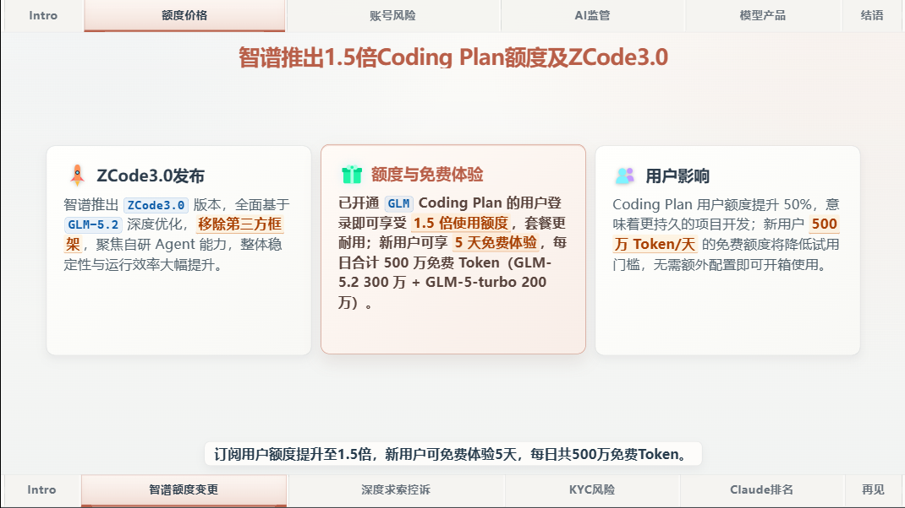
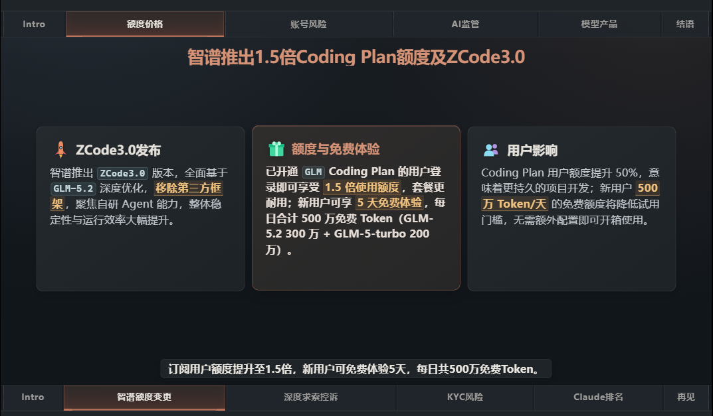

<div align="center">

# AI Daily Report

### 用 Remotion 构建的 AI 日报自动视频生成

从 RSS 内容采集、AI 筛选，到 TTS 旁白与视频生成，一条流水线完成每日内容生产。

[使用导览](./demo/overview.html) · [RSS 配置](./ingest/readme.html) · [项目结构与流程](./docs/architecture.html)

<br />

[](https://remotion.dev)
[](https://react.dev)
[](https://www.typescriptlang.org/)
[](https://go.dev/)
[](https://bun.sh/)
[](https://tailwindcss.com/)

</div>

## 这是什么

一个把每天的 AI 新闻自动做成**带旁白视频**的项目：RSS 抓取 → AI 筛选 → TTS 配音 → 渲染成片，一条流水线。

不想读文档？先看 [可视化使用导览](./demo/overview.html)，30 秒就能跑起来。

## 演示效果

<table>
  <tr>
    <th align="center">亮色主题</th>
    <th align="center">暗色主题</th>
  </tr>
  <tr>
    <td><a href="./demo/demo-video.mp4"></a></td>
    <td><a href="./demo/demo-video.mp4"></a></td>
  </tr>
</table>

<p align="center"><a href="./demo/demo-video.mp4"><strong>▶ 查看完整视频演示</strong></a></p>

## 快速开始

**最快的方式：装好依赖，用示例数据预览，不用配置任何 Key。**

```bash
bun install
bun run preview        # 带旁白的完整示例
bun run preview:notts  # 无旁白的静音示例
```

看到画面了，说明项目跑起来了。然后再按下面的方式真正出片。

## 怎么出片

### 方式一：一键自动（推荐）

配好 `.env`（见下）后，一条命令完成抓取、配音、生成图标：

```bash
bun run video:prepare   # 抓取 + 配音 + 图标
bun run dev             # 预览当前数据
bun run video:render    # 导出 mp4
```

### 方式二：手写内容

自己控制标题、配图、字幕：从示例复制一份再改。

```bash
cp -r demo/data-scheme-sample-1 data-scheme
# 编辑 data-scheme/data.json，图片放进 data-scheme/images/
bun run dev
```

## 准备环境

- **Bun · Go · Claude CLI** — 自动出片必需
- **ffmpeg** — 可选，用于 TTS 音质检；没有时设 `REQUIRE_VOICE_QUALITY_FFMPEG=false` 跳过

在项目根目录创建 `.env`（参考 `.env.example`）：

| 变量 | 作用 | 没有怎么办 |
| ---- | ---- | ---------- |
| `AI_API_KEY` | RSS 内容总结 | 自动出片必需 |
| `MINIMAX_API_KEY` | TTS 旁白 | 设 `TTS_REQUIRE=false` 关闭 |
| `CLAUDE_VISION_ENABLED` | 自动识图配图 | 设 `false` 关闭，只下载候选图供手填 |

> [!WARNING]
> 抓取 `linux.do` 需要能访问它（在 Cloudflare 后面）。网络受限时在根目录 `.env` 配小写 `all_proxy`（科学上网环境），如 `all_proxy=http://127.0.0.1:7890`。

## 卡住了？

直接用项目自带的 skill 提问：

```
/ai-daily-report <你的问题>
```

## 想深入

| 文档 | 内容 |
| ---- | ---- |
| [可视化使用导览](./demo/overview.html) | 图文版使用指南，最直观 |
| [项目结构与流程](./docs/architecture.html) | 目录组织、数据流、文件职责、时间线规则 |
| [RSS 配置](./ingest/readme.html) | 添加来源、兴趣偏好、筛选阈值 |

## 🐛 Bug / 使用问题

遇到 Bug 或使用问题，欢迎提 [Issue](https://github.com/TTT1231/ai-daily-report/issues)。

## ⭐ 支持一下

如果这个项目对你有帮助，欢迎点一个 [Star ⭐](https://github.com/TTT1231/ai-daily-report)
