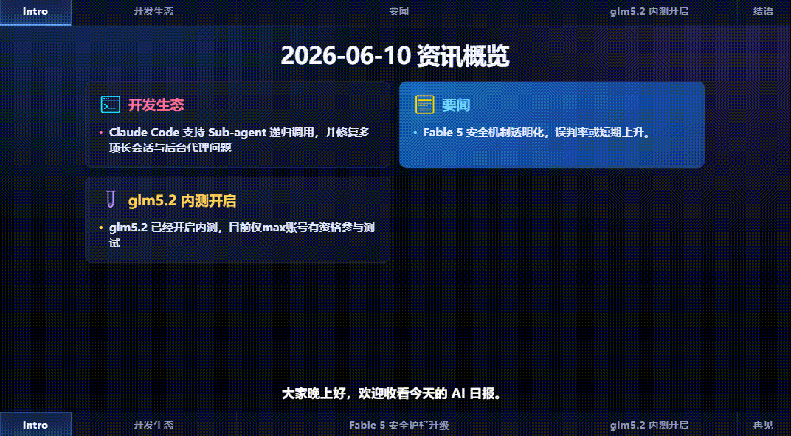

# AI Daily Report · Remotion 视频生成系统

基于 [Remotion](https://remotion.dev) 的 AI 日报视频生成系统，支持 TTS 旁白、双主题（亮色/暗色）、多卡片布局和完整的数据流水线。



## 快速开始

[html可视化文档](./.claude/claude.html)

```bash
# 1. 创建文件夹data-scheme放在项目根目录
#   - [] 准备数据，`data.json` 和 所需的images素材（可选）
#   - [] 确保 `data.json`中`$schema`指向项目根目录的`data-schema.json`,

# 2. 只在项目根目录创建一份 .env，Remotion、TTS 与 rss/ Go 工具共同读取
# 填写以下环境变量例如
# MINIMAX_API_KEY=<your-api-key>
# MINIMAX_TTS_ENDPOINT=https://api.minimaxi.com/v1/t2a_v2
# 根据需求选择对应的tts model
# MINIMAX_TTS_MODEL=speech-2.8-hd
# 选择你最爱的音色id
# MINIMAX_TTS_VOICE_ID=Chinese_sweet_girl_vv1
# MINIMAX_TTS_SPEED=1
# DEEPSEEK_API_KEY=<your-api-key>
# 默认控制在约 27 RPM，并在 MiniMax RPM 限流时自动等待重试
# MINIMAX_TTS_REQUEST_INTERVAL_MS=2200
# MINIMAX_TTS_MAX_RETRIES=5
# MINIMAX_TTS_RATE_LIMIT_RETRY_MS=60000
# TTS_TAIL_PADDING_MS=250

# 3. 首次生成或手动生成 TTS 音频（需要 MiniMax API Key）
# 通常可跳过这一步，bun run dev 会自动生成并持续监听 data.json
bun run tts

# 从 Linux.do RSS 获取 AI 新闻并生成 data-scheme/data.json
bun run rss

# 4. 根据需要生成icon（可选通过skill，tabs的图标）
# claude: /generate-svg
# codex: /generate-svg

# 5. 启动自动同步和 Remotion Studio
bun run dev
```

开发模式会监听 `data-scheme/data.json`、`data-schema.json`、`.env` 和图片素材：

- 修改 `data.json`、Schema 或 TTS 环境配置时，自动运行增量 TTS 并更新 `data-generate.json`。
- 未改变字幕的场景会复用已有音频；只增加或修改 `overlay.src` 不会重新请求旁白。
- 仅替换图片文件时交由 Remotion Studio 刷新，不运行 TTS。
- `.gitignore` 只影响 Git，不影响开发监听或 Remotion 的 `publicDir`。

## 示例数据

参考项目中[data-scheme-sample](./data-scheme-sample)里面的数据。
