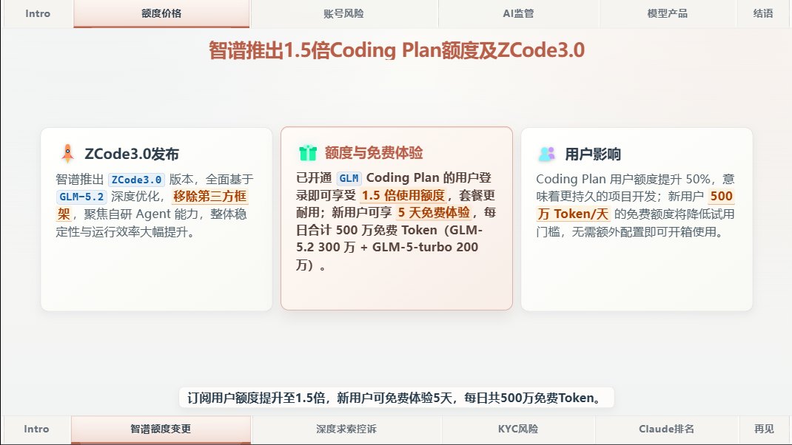
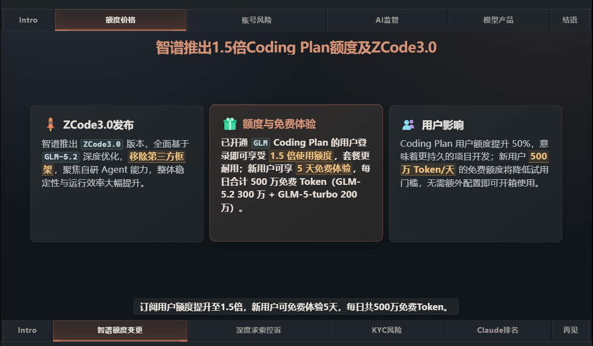

<div align="center">

# AI Daily Report

### 用 Remotion 构建的 AI 日报自动视频生成

从 RSS 内容采集、AI 筛选，到 TTS 旁白与视频生成，一条流水线完成每日内容生产。

[使用导览](./demo/overview.html)

<br />

[](https://remotion.dev)
[](https://react.dev)
[](https://www.typescriptlang.org/)
[](https://go.dev/)
[](https://bun.sh/)
[](https://tailwindcss.com/)

</div>

## 这是什么

一个把每天的 AI 新闻自动做成**带旁白视频**的项目。你只需要跑几条命令（或者把素材直接丢给 AI），就能得到一条可以投稿的 mp4。

## 演示效果

<table>
  <tr>
    <th align="center">亮色主题</th>
    <th align="center">暗色主题</th>
  </tr>
  <tr>
    <td><a href="./demo/demo-video.mp4"></a></td>
    <td><a href="./demo/demo-video.mp4"></a></td>
  </tr>
</table>

<p align="center"><a href="./demo/demo-video.mp4"><strong>▶ 查看完整视频演示</strong></a></p>

## 第一步：安装

1. 装好 [Bun](https://bun.sh/)（必装）和 [Go](https://go.dev/) 1.21+（要抓 RSS 才需要）
2. 克隆项目并安装依赖：

```bash
git clone https://github.com/TTT1231/ai-daily-report.git
cd ai-daily-report
bun install
```

## 先跑个演示（不用配任何 Key）

```bash
bun run preview        # 带旁白的完整示例
bun run preview:notts  # 无旁白的静音示例
```

浏览器会自动打开预览页面（没自动打开就手动访问 `localhost:3000`），看到画面说明项目装好了。看完继续往下，配好 Key 正式出片。

## 怎么出片

出片前先照「配置」一节建好 `.env`。然后按你的口味三选一：

### 方式一：全自动（最省事）

AI 自己选新闻、写稿、配图、配音，一条命令：

```bash
bun run video:auto-generate   # 抓取 → 写稿 → 配音 → 图标
bun run dev                   # 打开预览看看效果
bun run video:render          # 满意后导出 → out/AiDailyReport.mp4（首次会先下载渲染内核，稍等）
```

### 方式二：半自动（自己挑新闻）

命令会打开一个本地网页，把想做的新闻**勾上并保存**，回到终端等它跑完：

```bash
bun run video:half-auto       # 归档 → 抓取 → 网页勾选 → 生成
bun run dev                   # 预览
bun run video:render          # 导出 mp4
```

### 方式三：供稿模式（手头已有素材）

看到好新闻想直接做？把**链接、文本、截图**丢给你的 AI 助手（Codex / Claude Code 等装了本项目的均可），说一句：

```
/codex-generate-video <粘贴你的素材>
```

AI 会产出一条强制带证据截图的日报视频。

### 出片收尾

导出后顺手生成投稿要用的**标题、标签、评论**（B 站风格跳转评论）：

```bash
bun run video:meta
```

结果在 `data-scheme/video-meta.json` 和 `data-scheme/comments.txt`，复制去投稿即可（本项目不自动上传任何平台）。

## 配置

复制 `.env.example` 为 `.env`（Windows 用 `copy .env.example .env`），按需填写：

| 变量 | 干什么用 | 不配会怎样 |
| ---- | -------- | ---------- |
| `AI_API_KEY` | AI 读 RSS、写稿 | 方式一 / 方式二跑不了，必填 |
| `MINIMAX_API_KEY` | 旁白配音 | 设 `TTS_REQUIRE=false` 可跳过，出无声视频 |
| `CLAUDE_VISION_ENABLED` | 自动识图配图 | 设 `false`，改为下载候选图供你手填 |
| `all_proxy` | 抓 linux.do 用的代理 | 该来源会报错（其他来源不受影响） |

- 自动配图还需要装 Claude CLI；ffmpeg 可选（没装就设 `REQUIRE_VOICE_QUALITY_FFMPEG=false`）。
- `AI_BASE_URL` / `AI_MODEL` 等其余变量都有默认值，详见 `.env.example` 里的注释。

## 卡住了？

直接用项目自带的 skill 提问，报错、数据不合法、流程不懂都行：

```
/ai-daily-report <你的问题>
```

## 想深入

| 文档 | 内容 |
| ---- | ---- |
| [可视化使用导览](./demo/overview.html) | 图文版使用指南，最直观 |
| [CHANGELOG](./CHANGELOG.md) | 每个版本改了什么 |

## 🐛 Bug / 使用问题

遇到 Bug 或使用问题，欢迎提 [Issue](https://github.com/TTT1231/ai-daily-report/issues)。

## ⭐ 支持一下

如果这个项目对你有帮助，欢迎点一个 [Star ⭐](https://github.com/TTT1231/ai-daily-report)
